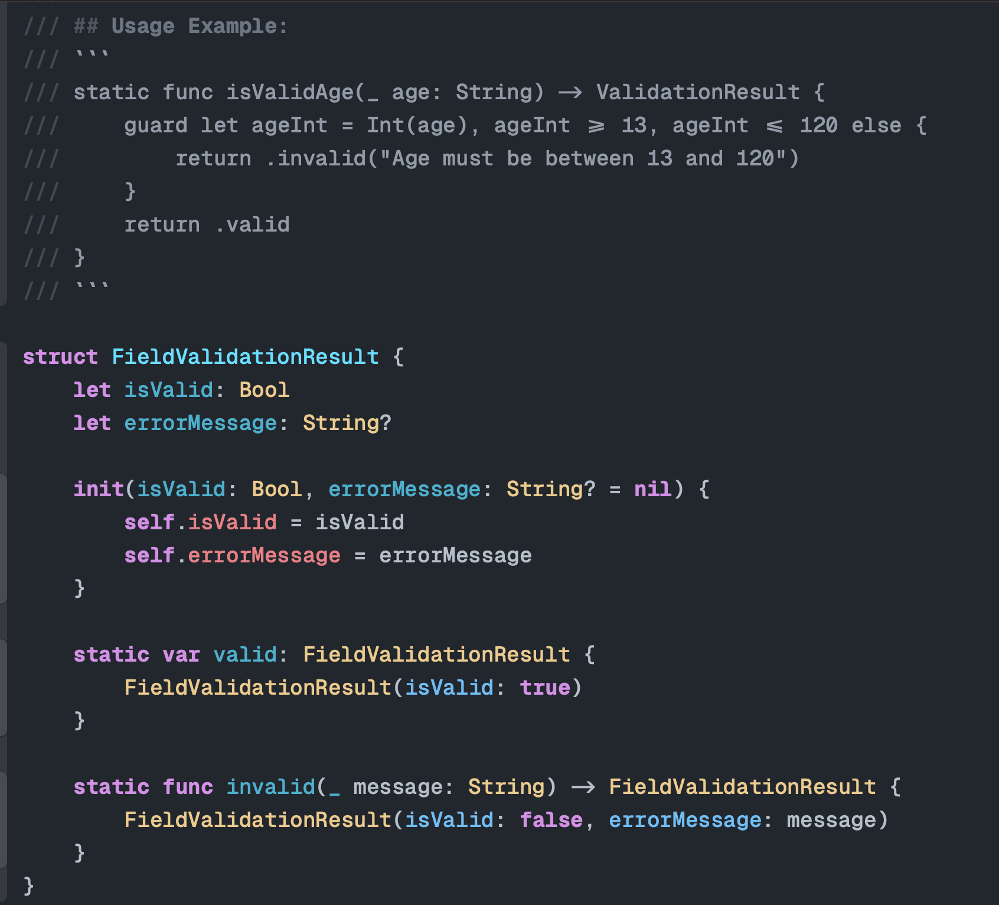

# Xcode Setup: One Dark Theme & VSCode Keybindings

When I switched from VS Code to Xcode, I really struggled with the change. The unfamiliar interface and shortcuts slowed me down, and I missed the comfort of my old workflow. So, I made this setup to bring some VS Code familiarity to Xcode. It helped me be more productive, even though it was a complete switch.

## Preview



## Features

 - **One Dark Theme**
 - **VS Code Keybindings**
 - **Geist Mono Font**

## Installation

### Automatic Installation (Recommended)

Run the provided install script to copy the theme and keybindings automatically:

```zsh
chmod +x install.sh
./install.sh
```

Restart Xcode to see the changes.

### Font Installation

To get the Geist Mono font:

- Install via Homebrew:
  ```zsh
  brew install --cask font-geist
  ```
- Or download from the [official webpage](https://vercel.com/font).

Set Geist Mono as your editor font in Xcode preferences.

### Manual Installation

1. Copy `One Dark.xccolortheme` to your Xcode color themes directory:
	```
	~/Library/Developer/Xcode/UserData/FontAndColorThemes/
	```
2. Copy `VSCode.idekeybindings` to your Xcode keybindings directory:
	```
	~/Library/Developer/Xcode/UserData/KeyBindings/
	```


---

For keybind lookups, visit: [vscode-xcode-bridge.vercel.app](https://vscode-xcode-bridge.vercel.app/)

## License

Feel free to use and modify these files for personal use.
